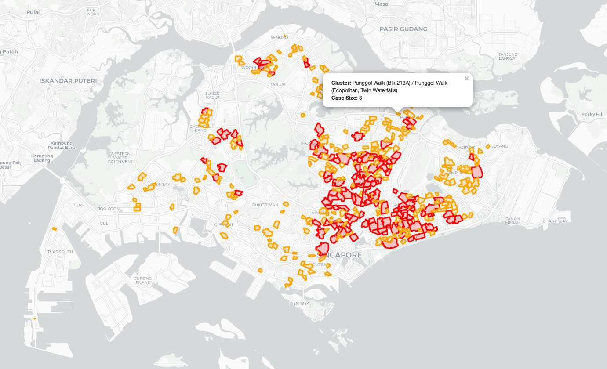

# dengue-clusters

Pulls the latest geographic data of dengue clusters in Singapore as GeoJSON, and stores it to `data/`.

To scrape for the data, run `scrape.py`:

``` sh
$ python scrape.py
```

For a map visualisation of the latest data, serve and visit the webpage:

``` sh
$ php -S localhost:8000
```


